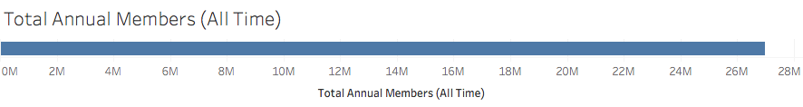
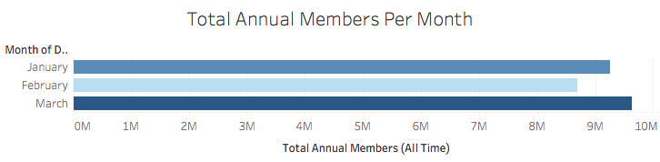
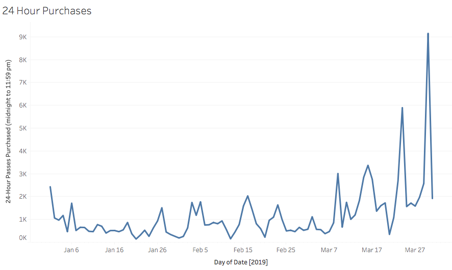
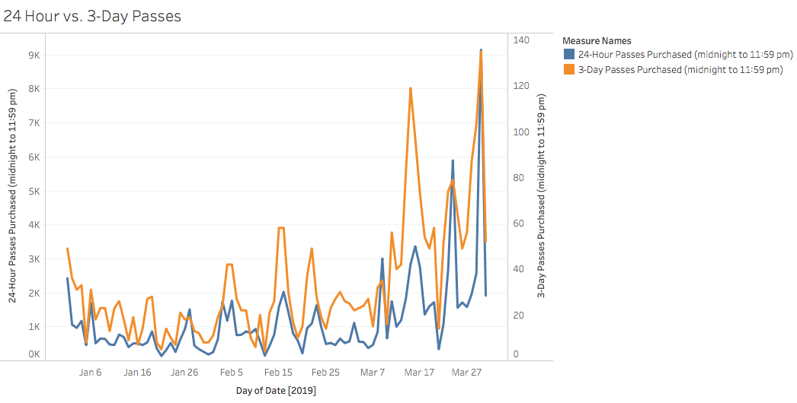
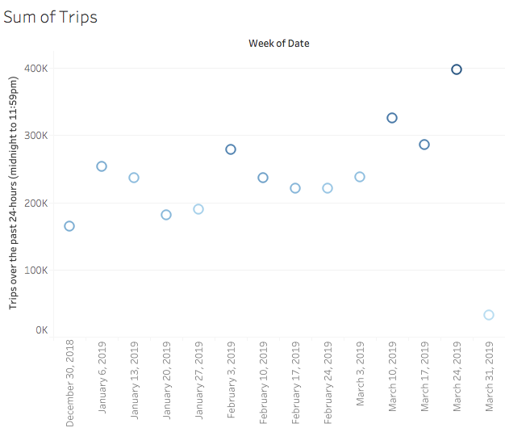
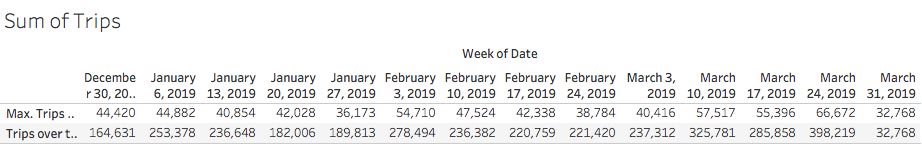
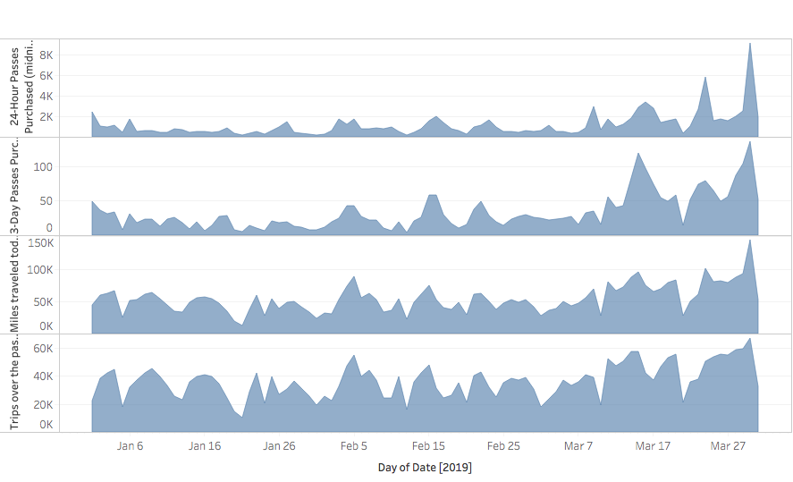
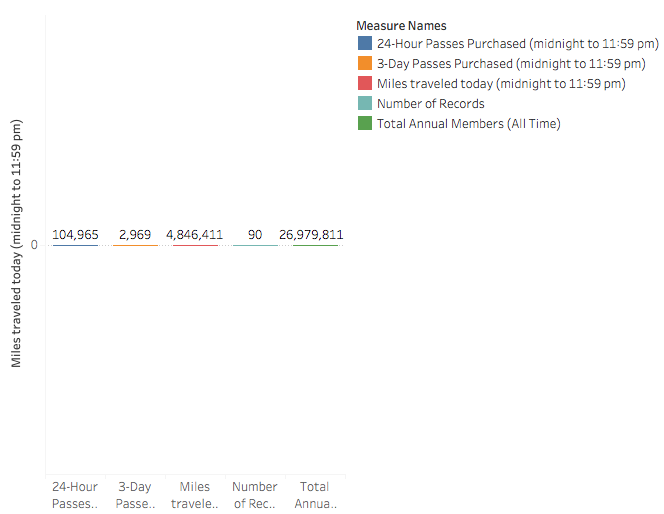
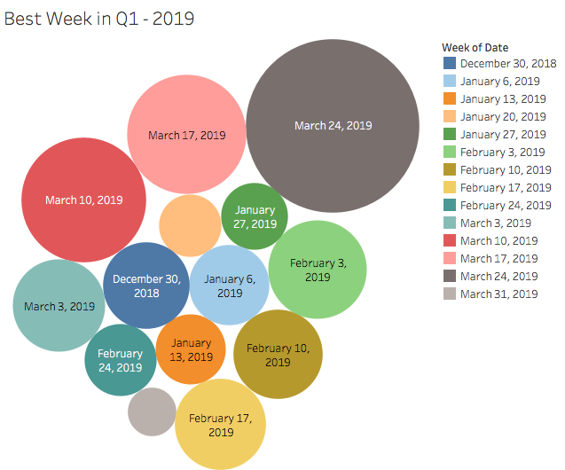

# Citi Bike Analysis


2019 - Q1 Analysis 







In the following graph we see amount purchases increased during the Summer months 




The graph below shows the comparison of 24 hour vs. 3 day passes - The same asumption can be seen that the purchases increased as the weather got better




Sum of Trips taken




Sum of Trips Taken - Represented in 3 different kind of charts

Table form
Line Chart
Bar Chart










```python

```
